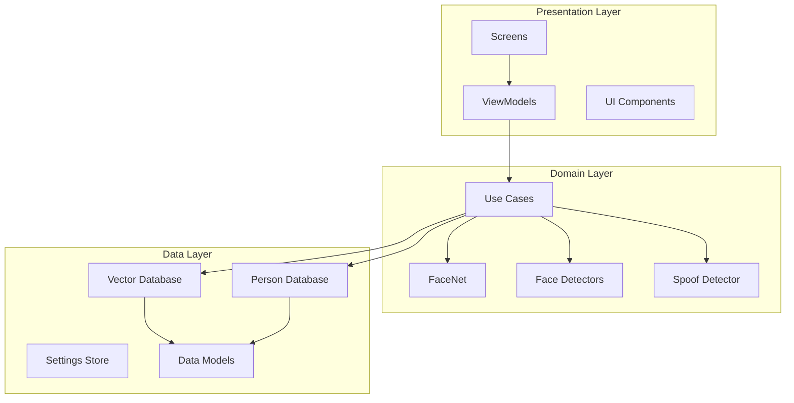
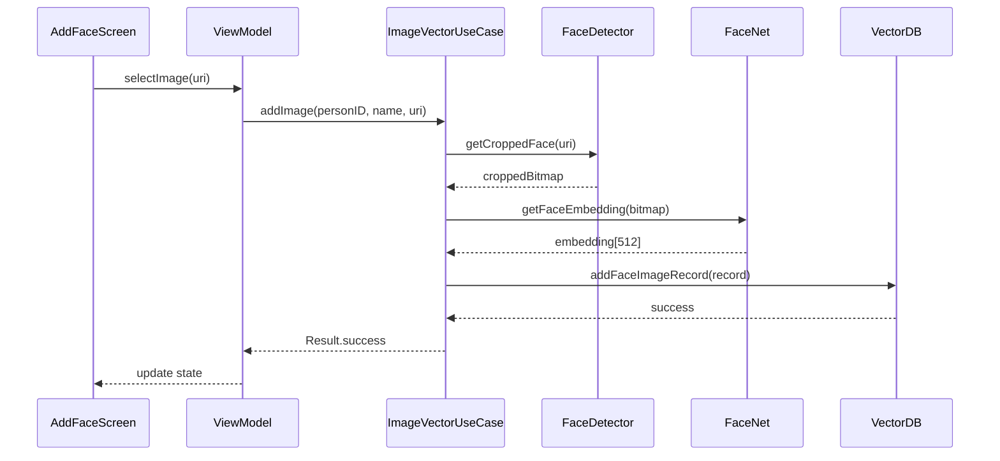
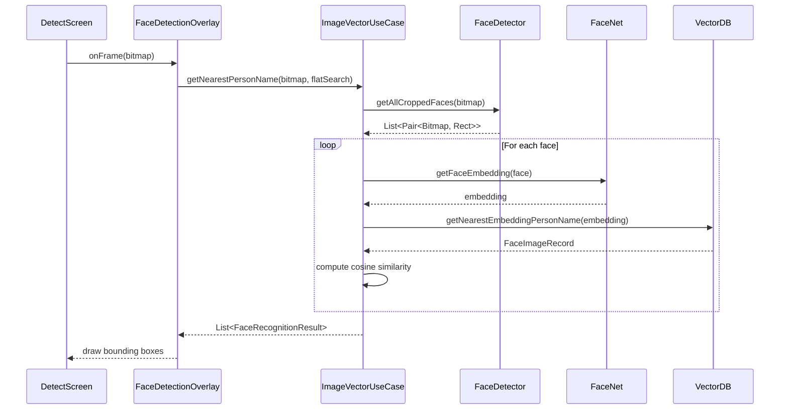

FaceNet Android follows modern Android development practices with a clean, layered architecture. This page explains the overall structure and how components interact.

## Architecture overview

The app uses a **three-layer architecture** with clear separation of concerns:



## Layer responsibilities

### Presentation layer

Handles all UI and user interactions using Jetpack Compose:

- **Screens**: Full-screen composables for different app features
  - `DetectScreen`: Real-time face recognition with camera
  - `AddFaceScreen`: Enroll new faces from gallery
  - `FaceListScreen`: View and manage stored faces

- **ViewModels**: State management and business logic coordination
  - `DetectScreenViewModel`: Manages camera frames and recognition results
  - `AddFaceScreenViewModel`: Handles image selection and enrollment
  - `FaceListScreenViewModel`: Lists persons and their face records

- **Components**: Reusable UI elements
  - `FaceDetectionOverlay`: Custom view for drawing bounding boxes
  - `AppAlertDialog`, `AppProgressDialog`: Standard dialogs

### Domain layer

Contains core business logic and ML model wrappers:

#### Use cases

Orchestrate complex operations across multiple components:

**`ImageVectorUseCase`** - Primary use case for face operations:

```kotlin
class ImageVectorUseCase(
    private val faceDetector: BaseFaceDetector,
    private val faceSpoofDetector: FaceSpoofDetector,
    private val imagesVectorDB: ImagesVectorDB,
    private val faceNet: FaceNet,
)
```

Key methods:
- `addImage()`: Enroll a face from URI
- `getNearestPersonName()`: Recognize faces in frame
- `removeImages()`: Delete face records

**`PersonUseCase`** - Manages person records:
- Create/delete person entries
- Track number of images per person
- Handle person metadata

#### Model wrappers

**`FaceNet`** - Embedding generation:
- Loads TFLite model (`facenet_512.tflite`)
- Configures GPU/NNAPI acceleration
- Normalizes input images
- Returns 512D embeddings

**`BaseFaceDetector`** - Abstract detector interface:
- `getCroppedFace()`: Detect single face from URI
- `getAllCroppedFaces()`: Detect multiple faces from Bitmap
- Handles EXIF orientation correction
- Validates bounding boxes

**`FaceSpoofDetector`** - Anti-spoofing detection:
- Runs two MiniFASNet models at different scales
- Performs RGB to BGR conversion
- Combines predictions with softmax

### Data layer

Manages persistence and data models:

#### Databases

**`ImagesVectorDB`** - Face embedding storage:
- Wraps ObjectBox for vector operations
- Supports ANN (HNSW) and flat search
- Implements cosine similarity
- Parallelizes linear search across 4 threads

**`PersonDB`** - Person record storage:
- Maintains person metadata
- Links to face image records via `personID`
- Tracks enrollment timestamps

**`ObjectBoxStore`** - Database initialization:
- Singleton store instance
- Initialized in `MainApplication.onCreate()`

#### Data models

```kotlin
@Entity
data class FaceImageRecord(
    @Id var recordID: Long = 0,
    @Index var personID: Long = 0,
    var personName: String = "",
    @HnswIndex(
        dimensions = 512,
        distanceType = VectorDistanceType.COSINE
    ) var faceEmbedding: FloatArray = floatArrayOf()
)

@Entity
data class PersonRecord(
    @Id var personID: Long = 0,
    var personName: String = "",
    var numImages: Long = 0,
    var addTime: Long = 0
)
```

## Dependency injection

The app uses **Koin** for dependency injection with annotations:

```kotlin
@Module
@ComponentScan("com.ml.shubham0204.facenet_android")
class AppModule {
    private var isMLKit = true

    @Single
    fun provideFaceDetector(context: Context): BaseFaceDetector = 
        if (isMLKit) {
            MLKitFaceDetector(context)
        } else {
            MediapipeFaceDetector(context)
        }
}
```

Components annotated with `@Single` are automatically injected:
- `FaceNet`
- `FaceSpoofDetector`
- `ImagesVectorDB`
- `PersonDB`
- `ImageVectorUseCase`
- `PersonUseCase`

<Note>
The choice between MLKit and Mediapipe face detectors is configured at compile-time in `AppModule.kt` by setting `isMLKit`.
</Note>

## Component interactions

### Enrollment flow



### Recognition flow



## Thread management

The app uses Kotlin coroutines for concurrency:

- **Main dispatcher**: UI updates, user interactions
- **IO dispatcher**: File operations, database queries, face detection
- **Default dispatcher**: CPU-intensive tasks (embedding generation, similarity calculation)

<Info>
ML model inference (FaceNet, spoof detection) runs on `Dispatchers.Default` to avoid blocking I/O operations.
</Info>

## Configuration points

Key architectural decisions can be configured:

1. **Face detector choice**: `AppModule.kt` - MLKit vs Mediapipe
2. **FaceNet model**: `FaceNet.kt` - 128D vs 512D embeddings
3. **Search method**: `FaceDetectionOverlay.kt` - ANN vs flat search
4. **Similarity threshold**: `ImageVectorUseCase.kt` - Recognition sensitivity
5. **GPU acceleration**: `FaceNet.kt` - GPU, NNAPI, or CPU-only

## Package structure

```
com.ml.shubham0204.facenet_android/
├── data/
│   ├── DataModels.kt
│   ├── ImagesVectorDB.kt
│   ├── PersonDB.kt
│   ├── ObjectBoxStore.kt
│   └── SettingsStore.kt
├── domain/
│   ├── embeddings/
│   │   └── FaceNet.kt
│   ├── face_detection/
│   │   ├── BaseFaceDetector.kt
│   │   ├── MLKitFaceDetector.kt
│   │   ├── MediapipeFaceDetector.kt
│   │   └── FaceSpoofDetector.kt
│   ├── ImageVectorUseCase.kt
│   ├── PersonUseCase.kt
│   └── ErrorHandling.kt
├── presentation/
│   ├── screens/
│   │   ├── detect_screen/
│   │   ├── add_face/
│   │   └── face_list/
│   ├── components/
│   └── theme/
└── di/
    └── AppModule.kt
```

<Tip>
This structure follows Android's recommended architecture guidelines with clear separation between data, domain, and presentation layers.
</Tip>