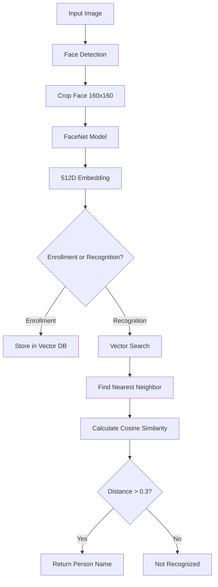

FaceNet Android performs on-device face recognition by combining face detection, embedding generation, and vector similarity search. This page explains the complete workflow from image input to person identification.

## Overview

The face recognition system works in two distinct phases:

1. **Enrollment phase**: Users select images and label them with person names. The app extracts face embeddings and stores them in a local vector database.
2. **Recognition phase**: The camera captures frames in real-time, extracts face embeddings, and matches them against the stored database.

## Face recognition workflow



## Step-by-step process

### 1. Face detection

When a user selects an image or the camera captures a frame, the app uses either MLKit or Mediapipe to detect faces:

- **MLKit FaceDetector**: Google's on-device face detection with fast and accurate modes
- **Mediapipe FaceDetector**: Uses the BlazeFace short-range model for lightweight detection

The detector returns bounding boxes for all detected faces in the image.

<Note>
The app validates that bounding boxes fit within image dimensions before cropping to prevent errors.
</Note>

### 2. Face embedding generation

Each detected face is cropped and processed through the FaceNet model:

- Input: 160×160 RGB face image
- Processing: Image is normalized (pixel values divided by 255)
- Output: 512-dimensional embedding vector (or 128D with the alternate model)

The embedding captures unique facial features that identify the person. Mathematically:

```
M(face_image) → embedding ∈ ℝ^512
```

Where `M` represents the FaceNet model function.

### 3. Storage (enrollment)

During enrollment, each embedding is stored in ObjectBox with metadata:

```kotlin
FaceImageRecord(
    personID = personID,
    personName = personName,
    faceEmbedding = embedding  // 512-dimensional FloatArray
)
```

ObjectBox automatically indexes the embedding using HNSW (Hierarchical Navigable Small World) for fast approximate nearest-neighbor search.

### 4. Vector search (recognition)

When recognizing faces in camera frames:

1. Extract embedding from detected face (query vector)
2. Search vector database for nearest neighbor
3. Retrieve top candidate with highest similarity
4. Re-compute cosine similarity for precision
5. Apply threshold to determine match

<Info>
The app re-computes cosine similarity because ObjectBox performs lossy compression on embeddings, making the returned distance an estimate.
</Info>

### 5. Similarity comparison

The system uses cosine similarity to compare embeddings:

```
cosine_similarity(a, b) = (a · b) / (||a|| × ||b||)
```

A similarity score above **0.3** indicates a match. The threshold balances:

- **Higher threshold** (e.g., 0.5): Fewer false positives, more false negatives
- **Lower threshold** (e.g., 0.2): More false positives, fewer false negatives

### 6. Spoof detection (optional)

For matched faces, the system optionally runs anti-spoofing detection using MiniFASNet:

- Processes face at two different scales (2.7× and 4.0×)
- Detects whether the face is real or a photo/video spoof
- Combines outputs using softmax averaging

<Tip>
Spoof detection helps prevent attacks using printed photos or video replays of authorized users.
</Tip>

## Performance metrics

The app tracks latency for each operation:

- **Face detection**: ~20-50ms per frame
- **Embedding generation**: ~30-100ms per face
- **Vector search**: ~5-20ms (ANN) or 50-200ms (flat search)
- **Spoof detection**: ~40-80ms per face

Actual performance depends on device hardware and selected options (GPU acceleration, search method, etc.).

## Search modes

### Approximate Nearest Neighbor (default)

- Uses ObjectBox's HNSW index
- Fast but may not return the true nearest neighbor
- Good for real-time applications with many stored embeddings

### Flat search (precise)

- Linear scan through all embeddings
- Guarantees true nearest neighbor
- Parallelized across 4 coroutines for better performance
- Recommended for higher accuracy requirements

<Note>
Enable flat search in `FaceDetectionOverlay.kt` by setting `flatSearch = true`. This is slower but provides better recognition accuracy, especially with larger databases.
</Note>

## Mathematical foundation

FaceNet is trained using triplet loss, which ensures:

```
||f(anchor) - f(positive)||² + α < ||f(anchor) - f(negative)||²
```

Where:
- `f(x)` is the embedding function
- Anchor and positive are the same person
- Anchor and negative are different people
- `α` is the margin that enforces separation

This training objective means embeddings of the same person cluster together, while different people have distant embeddings.